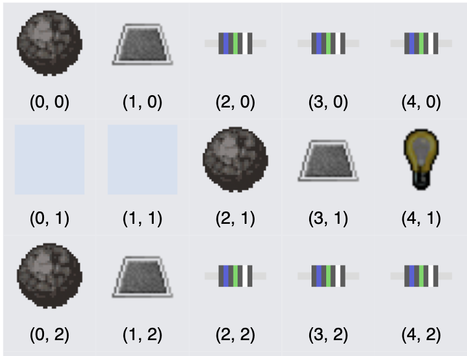

# Assignment II Pair Blog Template

## Task 1) Code Analysis and Refactoring ⛏️

### a) From DRY to Design Patterns

[part(a) MR link](https://nw-syd-gitlab.cseunsw.tech/COMP2511/24T2/teams/T17B_PUMPKIN/assignment-ii/-/merge_requests/2)

> i. Look inside src/main/java/dungeonmania/entities/enemies. Where can you notice an instance of repeated code? Note down the particular offending lines/methods/fields.

1. move method in Merecenary class and ZombieToast class has repeated code. 

> ii. What Design Pattern could be used to improve the quality of the code and avoid repetition? Justify your choice by relating the scenario to the key characteristics of your chosen Design Pattern.

1. Use Strategy pattern
2. The key characteristic of Strategy pattern is each strategy should be independent and each move strategy should be independent with other strategy, and doesn't have any relation with other move strategy. And encapsulating those move behaviors into different class, if other entiy has the same move behaviour, it can be reused. Also it's esay to extends, we can create a new strategy without changing content or other strategy, and it follows the open/close principle.

> iii. Using your chosen Design Pattern, refactor the code to remove the repetition.

1. first break the if-else in Mercenary class into different strategy, we have AlliedMove, FleeMove, HostileMove, RandomMove
2. also we create a strategy for SpiderMove
3. inside the ZombieToast class, since we have the same logic in if, so we can just create a new FleeMove, then create a ZombieToastMove for else

### b) Observer Pattern

> Identify one place where the Observer Pattern is present in the codebase, and outline how the implementation relates to the key characteristics of the Observer Pattern.

* Inside `Bomb.java`, there is a Observer Pattern.
* It maintains a `List<Switch>` subs list, this list represents the switchs that should be notifed
* The observers are in Switch class. They will observe the bomb lifecycle.
* Use `subscribe(Switch s)` method to add new observers
* Use `notfiy(GameMap map)` method to notify all switches when bomb is places or explodes. And `explode(map)` method will notify all observers when bomb exploed
* Use `onOverlap(GameMap map, Entity entity)` method to remove observers

### c) Inheritance Design

[part(c) MR link](https://nw-syd-gitlab.cseunsw.tech/COMP2511/24T2/teams/T17B_PUMPKIN/assignment-ii/-/merge_requests/4)
[Updated part(c) MR link](https://nw-syd-gitlab.cseunsw.tech/COMP2511/24T2/teams/T17B_PUMPKIN/assignment-ii/-/merge_requests/6)

> i. Name the code smell present in the above code. Identify all subclasses of Entity which have similar code smells that point towards the same root cause.

[Code smell here is Refused Bequest since subclass only use part of methods inherited from its parent. Exit class contains some pointless methods due the inheritence relation from Entity class, inculding method Overlap, Onmove and OnDestroy. And it also violates LSP.
All class: Wall.java, Switch.java, Portal.java, Exit.java, potion.java, player.java, Door.java, Boulder.java, Arrow.java, Bomb.java, key.java, Sword.java, treasure.java, wood.java, Buildable.java]

> ii. Redesign the inheritance structure to solve the problem, in doing so remove the smells.

[The reason of code smell is abtract method in Entity class
* Tranforming these methods to Interface. Create three new interfaces for each of them.  
* Delete these methods in Entity class hence subclass will not inherit them. 
* For all class that originally inherit these methods, implement relevant interface if they have logic in onOverlap, onMovedAway and onDestroy. For instance, Potion class can only implements OverlapInterface. 
* In this case, code smell is solved and easy to add new entities.]

### d) More Code Smells

[part (d) merge request](https://nw-syd-gitlab.cseunsw.tech/COMP2511/24T2/teams/T17B_PUMPKIN/assignment-ii/-/merge_requests/5)

> i. What design smell is present in the above description?

* Code smell is **shotgun surgery**
  * Cause from the description, we need to change all places to change the collectables to make it work, it's the same with the definition of shotgun surgery: have a little changes to a lot different classes

> ii. Refactor the code to resolve the smell and underlying problem causing it.

Since almost all collectable entities have the similar two method `public void onOverlap(GameMap map, Entity entity)` and `public boolean canMoveOnto(GameMap map, Entity entity)`.

Steps:
1. Create the `CollectableEntity` class which has `onOverlap` and `canMoveOnto` method and extends to `Entity` class, so this class will implement the OverlapInterace
2. Change all the collectable entities inherit `CollectableEntity` class and remove the same methods
3. Make sure after refactoring, all tests are passing
   
In the Bomb.class, the `canMoveOnto` method is a little bit different cause it needs to check the Bomb state, so we can override the method. Also we keep some classes just have the constructor like `Wood` class for extensibility and interaction.

### e) Open-Closed Goals

[part (e) merge request](https://nw-syd-gitlab.cseunsw.tech/COMP2511/24T2/teams/T17B_PUMPKIN/assignment-ii/-/merge_requests/7)
[Removed unnecessary steps](https://nw-syd-gitlab.cseunsw.tech/COMP2511/24T2/teams/T17B_PUMPKIN/assignment-ii/-/merge_requests/22)

> i. Do you think the design is of good quality here? Do you think it complies with the open-closed principle? Do you think the design should be changed?

1. In `Goal.java`, it follows the SRP principle, cause `achieved` method will check reaching the goals depend on different goal type. And Also in `GoalFactory.java`, the design uses the Factory pattern, using GoalFactory to get the target and use `achieved` method, so the design has a good quality but it doesn't compile open-closed principle
2. It doesn't complie with the open-close printciple, inside both `achieved` and `toString` method, using switch to deal with different type cases. If we want to add a new type then we need to add new case statement, it will have the violation of open-close principle (closed for modification)
3. Yes, I think the in `Goal.java`, should change it into Composite Pattern. Because I've seen that in `Goal.java`, we have `AND` and `OR` which will call the `achieved` or `toString` again, it's like the boolean node in and other's like `Treasure`, it's like value node. And it's better to work with the Factory Pattern

> ii. If you think the design is sufficient as it is, justify your decision. If you think the answer is no, pick a suitable Design Pattern that would improve the quality of the code and refactor the code accordingly.

Since inside the `achieved` method, we can see there is And and Or statement which will call the `achieved` method again. It'd better to use Composite pattern to refactor it. So `And` and `Or` are the Composites and Boudlers, Exit, Treasure are the leaves

Steps:
1. Create different classes for each goal type, so we have `AndGoal`, `BouldersGoal`, `ExitGoal`, `OrGoal`, `TreasureGoal` classes
2. All goal types classes will inherit the `Goal` class, then change original method in `Goal` class into abstract method and change `Goal.java` into an abstract class
3. Move the logic for `achieved` and `toString` for each goal type to it's corrosponding class
4. Updated the Factory pattern in `GoalFactory.java`, to create new Goal type class
5. Inside the `Goal` class, those variables seem used, and after refactoring, these can be removed
6. Make sure passing all the tests

### f) Open Refactoring

[Violation of LoD in BattleFacade.java MR link](https://nw-syd-gitlab.cseunsw.tech/COMP2511/24T2/teams/T17B_PUMPKIN/assignment-ii/-/merge_requests/8)

> Violation of Law of Demeter in `BattleFacade.java`

Inside `BattleFacade.java`, we found there are some commands look like `entity.getSomething().getSomething()` which will cause the violation of Law of Demeter

Steps:
1. For the health of `Player` and `Enemy`, I added the `getPlayerHealth` and `getEnemyHealth` method to get the health from `Player` and `Enemy`. And I addded `setPlayerHealth` and `setEnemyHealth` to set the health.
2. For `player.getInventory().getEntities(BattleItem.class)`, I create a method called `getBattleItems()` in `Player.java` which will return a list of BattenItems, also in `Inventory.java`, I created a method called `getItems` to get all the inventory items.
3. For `game.getMap().getEntities(Mercenary.class);`, inside `Game.java`, I create a method called `getMercenaries()` which will return `List<Mercenary>`
4. Make sure passing all tests

These steps will fix the violation of Law of Demeter in `BattleFacade.java`. And In `BattleFacade.java`, it seems it doesn't have a violation of LSP cause it doesn't extends any class.

[Violation of LoD in entities/enemies](https://nw-syd-gitlab.cseunsw.tech/COMP2511/24T2/teams/T17B_PUMPKIN/assignment-ii/-/merge_requests/9)

> Violation of Law of Demeter in `entities/enemies`

In `Mercenary.java` and `ZombieToast.java`, we found the violation of Law of Demeter in `map.getPlayer().getEffectivePotion()` and also in `ZombieToastSpawner.java`, we found `game.getEntityFactory().spawnZombie(game, this);` and `player.getInventory().getWeapon().use(game);`

Steps:
1. Inside `GameMap.java`, create new method called `getPlayerPotion`, it will return the player's potion effect
2. In `Game.java`, create a method to spawnZombie, then we can improve it into `game.spawnZombie(game, this)`
3. In `Player.java`, firstly create a method to use weapon, and in `Inventory.java`, use `getWeapon().use(game)` to use the weapon in the game, then in we can just use `player.useWeapon(game)` to use the weapon
4. Make sure still passing all tests

These steps will improve the violation of Law of Demeter

[Violation of LoD in entities](https://nw-syd-gitlab.cseunsw.tech/COMP2511/24T2/teams/T17B_PUMPKIN/assignment-ii/-/merge_requests/11)

> Violation of Law of Demeter in `entities`

In `EntityFactory.java`, we found `map.getPlayer().getPosition();` will cause the violation of LoD. Also for this `spawner.getPosition().getCardinallyAdjacentPositions();` `map.getGame().battle(this, (Enemy) entity);`. Also found similar command like `spawner.getPosition().getCardinallyAdjacentPositions();` in `Portal.java` and `Bomb.java`. In `Shield.java`, `game.getPlayer().remove(this);` also has the violation of LoD

Steps:
1. In `GameMap.java`, create a new method called `getPlayerPosition` which will return the Position
2. In `Entity.java`, create a method called `getAllCardinallyAdjacentPositions` which will return a list of Positions
3. In `GameMap.java`, create method called `startBattle` which will take in Player and Enemy to start the battle
4. In `Portal.java`, replace the `spawner.getPosition().getCardinallyAdjacentPositions();` with `getAllCardinallyAdjacentPositions`
5. In `Game.java`, create `removeShield` which will take in the shield that should be removed
6. Make sure passing all tests

These steps will improve the violation of LoD in entities

[Violation of LoD for the rest](https://nw-syd-gitlab.cseunsw.tech/COMP2511/24T2/teams/T17B_PUMPKIN/assignment-ii/-/merge_requests/12)

> Violation of LoD for the rest

Found `game.getMap().getEntities(Switch.class)` in `BouldersGoa.java`, similar command in `ExitGoal.java`. Also the command `game.getEntityFactory().spawnSpider(game)` in `GameMap.java` has the same violation. In `Game.java`, found `player.getBattleStatistics().getHealth()`, but in previous stage we have added method for getting player and enemy health, so just call it

Steps:
1. In `Game.java`, found these return Class List methods are quite similar, then combine them together `public <T> List<T> getEntitiesWithClass(Class<T> type)`, also change the method in `GameMap.java`, T will not extends Entity to make it more flexible.
2. In `Game.java`, create method called `spawnSpider` which will take in Game, it's different with spawnZombie cause spawnZombie will take in 2 arguments.
3. Updated `player.getBattleStatistics().getHealth()` or enemy into `Player.getPlayerHealth()` or enemy
4. Make sure passing all tests

Also, we found some commands like `nodes.get(curr).dosomething`, it doesn't be considered as violation of LoD cause nodes is a hashmap, using get is just the get the Position in the hashmap. All the violations of LoD are detected hopefully

[Fixed warnings for removal MR link](https://nw-syd-gitlab.cseunsw.tech/COMP2511/24T2/teams/T17B_PUMPKIN/assignment-ii/-/merge_requests/15)

> Warnings for removal

In `GameMap.java`, the command `translate(Position.calculatePositionBetween(getPosition(), p));` using the method in `Entity.java` which can be removed in the future. Also the same in `Bomb.java`. From the `@Deprecated(forRemoval = true)` method, previous developer left the message that said using `setPosition` method in current class

Steps:
1. In `Bomb.java` `onPutDown` method, change that command into `setPostiion(p)`
2. In `GameMap.java`, firstly get the newPosition using `Position.translateBy`. and then using `setPosition(newPosition)` to set the position
3. Remove the previous method in `Entity.java`
4. Make sure passing all tests

These steps will successfully update the translate method in `Entity.java` and improve the code/design quality

[hard coding in buildable entities MR link](https://nw-syd-gitlab.cseunsw.tech/COMP2511/24T2/teams/T17B_PUMPKIN/assignment-ii/-/merge_requests/16)

In `entities/buildables`, we can obviously see the hard coding (repeated code) in `Shield.java` and `Bow.java`, so we can just create a new abstract class which will extends to `Buildable`, and has a abstract method `applyBuff`. Also, we found `game.getPlayer().remove(this);` has the violation of LoD. I created method `removeItem` in `Game.java` which will remove the inventory item that passed in. In `Shield.java`, the `removeShield` is doing the same so it can be replaced by `removeItem` method

Steps:
1. Create the abstract class talked above
2. Move `use` and `getDurability` method to abstract class and create abstract `applyBuff`
3. Create `removeItem` in `Game.java` and updated the `use` method in `BuildableItems.java`
4. Make sure passing all tests

Creating an abstract class will improve the hard coding in `entities/buildables`.

> Poor design of player state
[Poor design of state MR link](https://nw-syd-gitlab.cseunsw.tech/COMP2511/24T2/teams/T17B_PUMPKIN/assignment-ii/-/merge_requests/18)
In `PlayerState.java`, there are four abstract methods that handles for transforming states of player. Subclasses (`InvincibleState.java`, `BaseState.java`, `InvisibleState.java`) of it are all having same logic on these abtract methods, which causes duplicate code and make it ineffective.

steps:
1. Change abstract methods to noraml methods.
2. Delete relevant logic in subclass since they share the same code.
3. Checkout all tests passes.

> Incorrect interface apply in potion class
[MR link to Fixing interface issue in potion class](https://nw-syd-gitlab.cseunsw.tech/COMP2511/24T2/teams/T17B_PUMPKIN/assignment-ii/-/merge_requests/20)
In `potion.java`, it implements a interface `Battleitem`. However, the effect of potion is applied before battle and potion is filtered during battle, which proved that potion should not apply `Battleitem` interface. This is Refused Bequest  code smell as it implements this interface but has no reaction to it.

steps:
1. Move out the interface part.
2. Delete relevant logic in `potion.java` such as `applyBuff` `use` methods.
3. Also in `InvisibilityPotion.java` and `InvincibilityPotion.java`. Removed uneccssary methods.  
4. Checkout all tests passes.

> Violation of LoD in PlayerState.java
[violation of LoD in playerState](https://nw-syd-gitlab.cseunsw.tech/COMP2511/24T2/teams/T17B_PUMPKIN/assignment-ii/-/merge_requests/31)
In `PlayerState.java`, the code in all transition method are all have `getPlayer().changeState()` which will cause the violation of LoD, since the `getPlayer()` method is the method inside PlayerState, So just can remove it

Steps:
1. Remove the `Player player = getPlayer();`

## Task 2) Evolution of Requirements 👽

### a) Microevolution - Enemy Goal

[Design MR link](https://nw-syd-gitlab.cseunsw.tech/COMP2511/24T2/teams/T17B_PUMPKIN/assignment-ii/-/merge_requests/21)
[Tests and implementation part a MR link](https://nw-syd-gitlab.cseunsw.tech/COMP2511/24T2/teams/T17B_PUMPKIN/assignment-ii/-/merge_requests/23)

**Assumptions**

* Whether allies destroyed by a player-placed bomb count towards the enemy goal is undefined.

**Design**

1. Create the `EnemyGoal` class under Goal folder and extends Goal class which has two method `achieved` and `toString`
2. `achieved` method will change two stuffs, using && to combine them together. And `toString` method is similar with other leaves node
   1. does it reach target amount of killed enemies
   2. does it destory all the spawners
3. In `Player.java`, create a new variable to get how many enemies player kill. And create Getter method and increment method to do amount ++
4. In `BattleFacade.java`, after updating the health, check enemy's health, if it's <= 0, then to increment kill amount
5. To check whether play has destoried all the spawners, create a boolean type method in `Player.java`, to get all the ZombieToast class entities, if the list is empty then which means there is no spawners in the game
6. In `GoalFactory.java`, add a case for enemy goal

**Changes after review**

* This is a reasonable design to add up a new goal `EnemyGoal.java` class as the origin code is refactored to a composite pattern which is easy to maintain and add up new pattern. The new `EnmyGoal.java` should also extend to `Goal.java` and implements its abtract method `achieved` and `tostring`.
* `Player` should have a new field to count number of enemies killed to achived the goal. Good.
* In `BattleFacade.java`, after each round checking health of ennemy, check condition if it is killed and is it the type of traget ennemy.
* For checking spawners(zombies or spider), you probably can not check in `player.java` since player have no permssion to get number of other enemy entities, player can only check out inventory item. Due to this, this check may be held on `game.java` by using `getEntitiesWithClass` method to checkout spawners.
* `GoalFactory.java` is good to add up a new goal.
* Others all good.

**Test list**

Instruction: 
PLA: player; SWO: sword; ZOM: zombie, EXI: exit, WAL: wall

Lists:
1. (1 enemy goal) only one enemy goal, no zombieToastSpawner, 1 zombieToast, 1 sword with durability = 1
  steps:
  * move down to get sword, and zombie will come to the smae place and will be killed
  
  |Diagram| | |
  | --- | --- | --- |
  | PLA | WAL | |
  | SWO | ZOM | WAL |
  | WAL | WAL |

2. (more enemy goal) 3 enemy goals, 1 sword with durability = 20, 3 zombieToast, no zombieToastSpawner
  steps:
  * move down to get sword
  * move right 2 times to kill

  |Diagram| | | | |
  | --- | --- | ---| --- | --- |
  |PLA| WAL | WAL | WAL |
  |SWO|ZOM|ZOM|ZOM| WAL |
  | WAL | WAL | WAL | WAL |

3. (finish the enemy goal first, then exit goal), 1 enemy goal, 1 sword with durability = 1, no zombieToastSpawner
  steps:
  * move down will not trigger the exit goal
  * move right to get the sword
  * move right to kill
  * move left twice to acheive the exit goal

  |Diagram| | | |
  | --- | --- | --- | --- |
  | PLA | WAL | WAL |
  | EXI | SWO | ZOM | WAL |
  | WAL | WAL | WAL | WAL |

For now, there is a bug in zombieToastSpawner which is it can't be killed, it can be fixed in task3 and more tests.

**Review for test list of task2 part a**
* Test list is concise and clear to understand, it designed a basic test for Enemy goal.
* While we can not kill the zombieToastSpawner, skip that part firstly, we will come back to it later.
* Others all good.

**Other notes**

Checking zombieToastSpawner has been implemented. But since zombieToastSpawner has a bug. So I didn't test this function for now. But will add more in task3

### Choice 1 (Sun Stone & More Buildables)

[Task2 part (d)](https://nw-syd-gitlab.cseunsw.tech/COMP2511/24T2/teams/T17B_PUMPKIN/assignment-ii/-/merge_requests/25)
[Updated sceptre](https://nw-syd-gitlab.cseunsw.tech/COMP2511/24T2/teams/T17B_PUMPKIN/assignment-ii/-/merge_requests/27)

**Assumptions**

* Where there are multiple valid options for creating a buildable entity, the precedence of items is undefined
* The behaviour of a sceptre after use is undefined
* The behaviour of possessing multiple sceptres is undefined
* When trying to open a door with both a key and a sunstone in the player's inventory, it is undefined which entity will be used.
* The behaviour when mind_control_duration is <= 0 is undefined.
* When a mercenary or assassin can be bribed and mind controlled at the same time, which action will be taken after the player interacts with them is undefined.
* Whether midnight armour counts as a weapon when destroying zombie toast spawners is undefined.

**Design**

Design for sun stone
1. Create `SunStone.java` under the collectables which will extend **`CollectableEntity`** and implement `InventoryItem`
2. Since sun stone can be used to open door, inside `Door.java`, create a similar method like `hasKey`, and let it called `hasSunStone` for now, but I think it could be refactored
3. Since it is classed as treasure it counts towards the treasure goal (according to the spec). So inside `Player.java` `pickup` methid, change `if (item instance of Treasure)` to `if (item instance of Treasure || item instance of SunStone)`
4. Midnight Armour can be crafted by sun stone, so inside `Inventory.java`, `getBuildables` method, should count the amount of sun stone as well. According to the spec, player processesses enough treasure or keys those should be preferred which means if we don't have keys then can use sun stone instead
5. In `EntityFactory.java`, if input is "sun_stone", then should create sunStone class

Design for midnight armour
1. Create `MidnightArmour.java` under the buildables, and it's gonna provide extra attack and protection forever, so don't need to get the durability, then just `super(null)`
2. The constructor of MidnightArmout should pass in `int defence` and `int attack` which is given by midnight_armour_defence and midnight_armour_attack. 
3. In applyEffect method, added the defence and attack to the player
4. In `inventory.java`, in getBuildables methid, if swords >= 1 and sunStones >= 1, result.add('midnight_armour').
5. In checkBuildCriteria method, reduce the materials and inside `EntityFactory.java`, create new method to build the midnight_armour
6. In `Game.java`, add a method to check if there is any zombie toast in game, and check if it's valid to build midnight_armour
7. In `GraphNodeFactory.java`, added midnight_armour

Design for Sceptre
1. Create class `sceptre.java` extend BuildableItems since it is  buildable ((1 wood OR 2 arrows) + (1 key OR 1 treasure) + (1 sun stone)), it should be built with durability and implemented method `applybuff` but has no effect to player's statistics. In use method set clicked mercenary to mind-contorl; For all entities with type of mercenanary , their moving method changed to `Mind-control` (allied). 
2. In `Mercenary.java` class, set a new field `IsMindControlled`, this can be used to move method to set its moving strategy as allied.
3. In `Inventory.java`, add a new checking condition for `sceptre` in getBuildables.
4. In `checkBuildCriteria` method, add logic of creating sceptre.
5. In `EntityFactocy` add new method of creating sceptre with sceptre_durability
6. Add `sceptre` in `GraphNodeFactory.java`.
**Changes after review**

Review for sun stone
* The sunstone logic looks good and it does a part of `CollectableEntity` then should be extended to it. And it can be picked up to 
* inventory of player acting as a key property.Sun stone can also be viewed as treasure hence it will be calculated in treasure goal.
* It is also a buildable material used to build `Midnight Armour`, then player need to get the number of sun stone.
* Overall logic is well.

Review for midnight armour
* The Design for midnight looks good, a new buildable item acting as battleitem can be used during a battle. 
* Its good to implement now.

Review for Sceptre
* In `Sceptre.java`, the constructor probably like `Sceptre(mindControlDuration)`, when create a new Sceptre, just pass in the mindControlDuration from json file
* In `Mercenary.java`, it's good to create `IsMindControlled`, but for duration, you can add a field `mindControlledTick`, after 1 tick, `mindControlledTick --`, when it's less than 0, turn `isMindControlled` into false.
* Others look good for now

**Test list**

Test list for sun stone

Instruction: 
PLA: player; DOR: door; SUN: sun stone; EXI: exit; TRE: treasure; WOO: wood

1. check can use sun stone to open the door
   
  steps:
   * try to open the door first (can't)
   * get the sun stone and try to open the door again
  
  | diagram | | |
  | --- | --- | --- |
  | PLA | | SUN |
  | | | DOR |
  | SUN | DOR | EXI|

2. check can be treated as a tresure and reach the treasure goal
  
  steps:
  * go get the sun stone and treasture to reach the treasure_goal 2
  
  | diagram | | |
  | --- | --- | --- |
  | PLA | SUN | TRE | 

3. check can use sun stone to build shield and with no consumption
   
   steps:
   * move right to get woods, and sun stone
   * try to build shield
   * check the material remainings
  
  | diagram | | | |
  | --- | --- | --- | --- |
  | PLA | WOO | WOO | SUN |

Test list for midnight armour

Instruction:
PLA: player; SUN: sun stone; SWO: sword; EXI: exit

1. check doesn't throw IllegalArgumentException
2. check throw InvalidActionException if there are zombies
   
  steps:
  * check dones't throw IllegalArgumentException
  * place a zombie somewhere, and check player can't build midnight armour
3. check throw InvalidActionException if don't have enough materials
   
  steps:
  * there is only sun stone in the game, check player can't build midnight armour cause doesn't have enough materials
4. check can build the midnight armour
  
  steps:
  * right move get the sword and sun stone
  * build mignight armour
  
  | Diagram | | | |
  | --- | --- | --- | --- | 
  | PLA | SWO | SUN | EXI | 

* Test list for Sceptre

* Entities: wood, arrow, key, treasure, sunstone
* Instruction:
* PLA: player; SUN: sun stone; KEY: key; EXI: exit
* WOD: wood; TRE: treasure; MER: Mercenary
* Test1: Build Sceptre with 1wood + 1key + 1sunstone
* Step: go get all material for crafting sceptre

| Diagram |     |     |     |
|---------|-----|-----|-----|
| WOD     | KEY | SUN | EXI |

* Test2: Build Sceptre with 2 arrows + 1 treasure + 1sunstone

* Step: go get all material for crafting sceptre 

| Diagram |      |     |     |
|---------|------|-----|-----|
| PLA     |      |     |     |
| ARW     |      |     |     |
| ARW     | TRE  | SUN | EXI |

* Test3: Build Sceptre with no enought material, should throw error

* Step: no enough material for crafting this, should throw an error if player build it

| Diagram |      |     |     |
|---------|------|-----|-----|
| PLA     |      |     |     |
| ARW     |      |     |     |
| ARW     | TRE  |     | EXI |

* Test4: Build Sceptre and use it to contorl mercenary

* Step: go get all material for crafting sceptre and use it to control mercenary

| Diagram |      |     | MER |
|---------|------|-----|-----|
| PLA     |      |     |     |
| ARW     |      |     |     |
| ARW     | TRE  | SUN | EXI |

**Test review**

Test review for sun stone
* Test looks good, easy to read and follow.

**Test review**

Test review for Midnight Armour
* Tests shows different cases of buildnig `Midnight Armour` including the existing of Zombies and case for no enough material which satisfied the basic function for `Midnight Armour`.

**Test review**

Test review for sceptre
* Should add more tests for building sceptre, should add 1 wood + 1 treasure + 1 sun stone and 2 arrows + 1 key + sun stone
* Also according to the spec, sun stone can replace the treasure or key, but if player has enough treasure or key, should use treasure or key first. Spec: **when replacing another material such as a key or treasure in building entities, it is retained after use**
* While using sceptre to control mercenaries, while tick, should check mercenaries' positions are changed or not
* For error checking, should check IllegalActionException as well, when player doesn't have sceptre and wants to mind control mercenary, and doesn't have enough gold to bribe

**Other notes**

For sun stone
1. In collectables, every collectable enetities should belongs to InventoryItem, then we can just implement InventoryItem in `CollectableEntitiy.java`
2. Remeber to create new entity in `graphNodeFactory.java`
3. In `Door.java`, hasKey and hasSunStone method all have violation of LoD, should be fixed

For midnight armour
1. In `Invetory.java`, change checkbuildCriteria method's boolean isSheild to String enetity, and in checkbuildCriteria method, before build the enetity, should check what is the enetity. 

For Sceptre
1. Mercenary and player will probably share same position due to some edge cases using dijkstra
2. Added another check in `AlliedMove.java` after using dijkstra to find nextPosition
3. Just set the clicked mercenary into mindcontrol, not all mercenaries

**Refactoring after finish part d**
1. In `Door.java`, finish the violation of LoD found before.

### Choice 2 (Logic Switches)

[Task2 part f](https://nw-syd-gitlab.cseunsw.tech/COMP2511/24T2/teams/T17B_PUMPKIN/assignment-ii/-/merge_requests/26)
[Fixed switch_door bug](https://nw-syd-gitlab.cseunsw.tech/COMP2511/24T2/teams/T17B_PUMPKIN/assignment-ii/-/merge_requests/28)

**Assumptions**

* Whether the player can stand on light bulbs is undefined
* Any scenario where the order in which activated components perform their action is undefined

**Design**

1. Create Logic folder to contain all the logic switches
2. Should create a class to manage the whole logic switches, `Logic.java`
3. And should create a class to manage passing current and signal like `Wire.java`, gonna call it `Conductor.java`
4. Also to manage the rules of logic swithces, there should be another class `LogicalRules.java`, `SwitchDoor` and `LightBulb` will extends it. Here is just using Strategy pattern, to create the logical rules like OR AND XOR and CO_AND
5. And have a `RuleFactory.java`, using Factory pattern to generate the specific logical rule
6. Inside `Logic.java`, should check it's activated. And should get all the adjacent logical enetities. Also, since we wanna keep notifing adjacent logical enetities, so we use observer pattern.
7. Inside `Conductor.java`, since bomb also have option to be created as logical entities. Conductor will manage the connection with other logical entities using subscribe and unsubscribe. It will also control the activate status and activate tick
8. Inside `LogicalRulesFactory.java`, changing the activate status by check logic rules. Since we're using factory pattern, should create different rule classes to handle different rules.
9.  In `And.java`, if the activated adjacent logical entities >= 2 return true, otherwise return false
10. In `Or.java`, if the activated adjacent logical entities >= 1 return true, if the activated adjacent logical entities < 0 return false
11. In `Xor.java`, if the activated adjacent logical entities == 1 return true
12. In `Co_and.java`, if the activated adjacent logical entities >= 2 and on the same tick return true
13. When I want to set all the wires to true and false, I use BFS to traverse the whole map
14. For `Bomb.java`, change it extends to `LogicalRules` now and in `EntityFactory.java`, if there is no logic field, then automatically sign it to Or rule
15. In `SwitchDoor.java`, it's quit simialr with `Door.java`, but just need `canMoveOnTo` method.

**Changes after review**

* Design is good, `Observer pattern` and `Factory pattern` are efficient here to handle connection between entities. 
* For `And.java`, the total number of adjacent conductor is needed since we need all of them are activated. Might need to add extra conditoin for this logic.
* Others all good.

**Test list**

Instruction:

PLA: player; BOU: boulder; SWI: switch; LIB: light bulb; SWD: switch door; BOM: bomb

1. check lightBulbActive
   
  Steps:
  * push the boulder to the switch to turn on light bulb
  
  | Diagram | | | |
  | --- | --- | --- | --- |
  | PLA | BOU | SWI | LIB |

2. check switch door active
  
  Steps:
  * push the boulder to the switch to turn on swtich door
  
  | Diagram | | | |
  | --- | --- | --- | --- |
  | PLA | BOU | SWI | SWD |

3. test can turn on light bulb via wire
   
  Steps:
  * turn right to push the boulder to the switch

  | Diagram | | | | | | |
  | --- | --- | --- | --- | --- | --- | --- |
  | PLA | BOU | SWI | WIR | WIR | LIB |

4. test OR rule
   
  Steps:
  * move right to push the boulder on the switch
  * move down and right to push the boulder on the switch
  
  | Diagram | | | |
  | --- | --- | --- | --- |
  | PLA | BOU | SWI | LIB |
  | | | BOU | SWI |

5. test AND rule
  
  Steps:
  * move right to push the boulder on the switch
  * move down and right to push the boulder on the switch
  
  | Diagram | | | |
  | --- | --- | --- | --- |
  | PLA | BOU | SWI | LIB |
  | | | BOU | SWI |
  
6. test CoAND rule
   
  Steps:
  * move right to push the boulder on the switch
  
  | Diagram | | | |
  | --- | --- | --- | --- |
  | | | WIR | WIR |
  | PLA | BOU | SWI | LIB |
  | | | WIR | WIR |

7. test XOR rule
   
  Steps:
  * move down and right to turn on the swtich at 2,1, light should be on
  * move back to turn on the swtich at 2,0 light will be off
  
  | Diagram | | | | |
  | --- | --- | --- | --- | --- |
  | PLA | BOU | SWI | WIR | WIR |
  | | BOU | SWI | LIB | WIR |

8. test CoAND rule2
   
  Steps:
  * move up and right to activate the switch above the light bulb
  
  | Diagram | | | | |
  | --- | --- | --- | --- | --- |
  | | | | BOU | | 
  | | | | SWI | |
  | | | WIR | WIR | WIR |
  | PLA | BOU | SWI | | LIB |
  | | | WIR | WIR | WIR |

9. test for activating bomb with co_and rule
  
  Steps:
  * move right to push the boulder on the switch
  
  | Diagram | | | |
  | --- | --- | --- | --- |
  | | | WIR | WIR |
  | PLA | BOU | SWI | BOM |
  | | | WIR | WIR |

10. test for mult light bulbs with differnt logic rules
  
  light bulb at (6,1) is co_and
  at (8,1) is or
    
  Steps:
  * move right to push the boulder on the switch to activate it
  * Based on the logic rule, when the switch is activated, all the lights will be on
  
  | Diagram | | | | | | |
  | --- | --- | --- | --- | --- | --- | --- |
  | | | WIR | WIR | WIR | WIR | WIR |
  | PLA | BOU | SWI | | LIB | | LIB |
  | | | WIR | WIR | WIR | | |

11. test for can't turn on the co_and logic light_bulb
    
  Steps:
  * go up to move the upper boulder and activate the switch next to it
  * go down to move the lower boulder and activate the switch next to it
  * move away uppder boulde and lower boulder and activate the middle swtich
  

12. test for checking if two switches light up the same light, and inactivate one of those two switches, the light should be on

  Steps:
  * activate two switches
  * inactivate one of the switches
  * light should still on
  
  | Diagram | | | | |
  | --- | --- | --- | --- | --- |
  | | | | BOU | | 
  | | | | SWI | |
  | | | WIR | WIR | WIR |
  | PLA | BOU | SWI | | LIB |
  | | | WIR | WIR | WIR |

**Test Reviews**
* The test 6 for `CoAnd` will fail since two swtiches are activated on different cases, we might change it to using wire to activate light buld just like in sample example. From spec: [`In the case that another conductor powers an already activated component, the current is not 'refreshed'. The co_and case should rely on the tick the adjacent conductor is initially powered from a deactivated state.`]
* Other tests are alright, perhaps we need more tests to verify different cases, especially logic `CoAND` which contains few stiuations like activating switches at different tick or same tick.

**Other notes**
* Player can't go through the switch door, but now it's fixed.

## Task 3) Investigation Task ⁉️

[Bugs found for task3](https://nw-syd-gitlab.cseunsw.tech/COMP2511/24T2/teams/T17B_PUMPKIN/assignment-ii/-/merge_requests/29)

* Bugs Found
1. Mercenary can be brided out of radius.
2. Player can pick more than one keys at same time.
3. Player can not destroy zombie toast spawner.

Steps:
1. In `Mercenary.java` method `canBeBribed`, add logic to check if player can bride mercenary in its radius. By calculating the distance between player and mecenary.
2. In `Player.java` method `pickup`, add a check condition for currnent key number inside inventory.
3. For `zombieToastSpawner.java`, added destory command to `interact` method. 
4. In case bomb will be place as inventory state, added a check in method `onOverlap` to guranteen only player can interact with bomb.

[Mercenary doesn't go randomly when player is invisible](https://nw-syd-gitlab.cseunsw.tech/COMP2511/24T2/teams/T17B_PUMPKIN/assignment-ii/-/merge_requests/30)

* Bugs Found
1. Mercenary doesn't go randomly when player is invisible

Steps: 
1. In `Mercenary.java`, create a private method to check whether the player has potion
2. In `move` method, check if player has potion, then will not do allied movement 

[Bomb should be exploded in place state](https://nw-syd-gitlab.cseunsw.tech/COMP2511/24T2/teams/T17B_PUMPKIN/assignment-ii/-/merge_requests/32)

* Bugs Found
1. Bomb will be explode in any state, but only should be in place state

Steps:
1. In `Bomb.java`, before doing the explode process, firstly check if the state the PLACED
2. To distinguish the logical bomb and normal bomb, also add isActivated()

[Bug in portal](https://nw-syd-gitlab.cseunsw.tech/COMP2511/24T2/teams/T17B_PUMPKIN/assignment-ii/-/merge_requests/35)

* Bugs Found
1. Previously, player can only be teleported if all 4 directions are empty, but if one position is empty, then player can be teleported

Steps:
* In `Portal.java` canTeleportTo method, change allmatch to anymatch